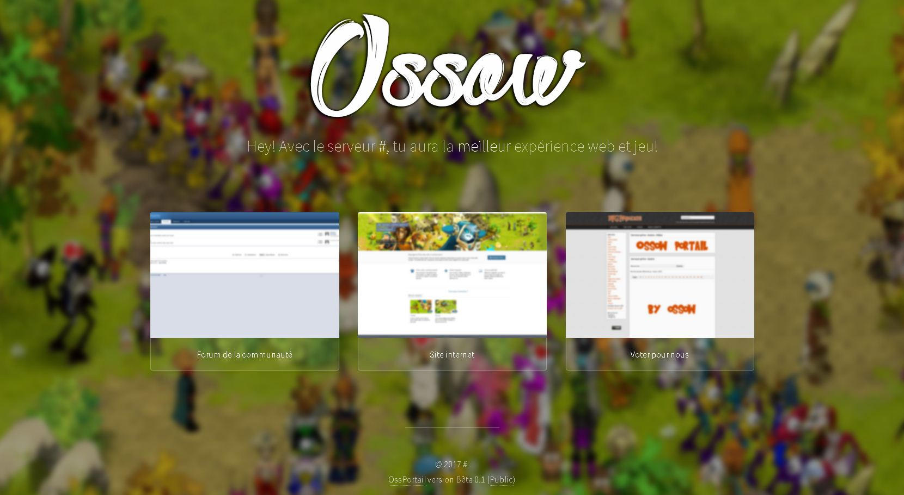

# OssPortail v0.1
La version du portail nommer "OssPortail" en version 0.1 avant la fusion priver avec l'OssCMS.

Cette version du Portail est partager en Public, je ne ferais pas moi-même les postes sur DozenofElites et autres forum d'Emulation.

J'autorise le partage du moment qu'aucun fichier/copyright ne soie modifier pour s'approprier le travail.

# Comment installer le portail?

L'installation est pas très compliquer, il vous faut l'upload sur votre FTP de votre serveur la où vous voulez en tout cas qu'il soie afficher, ensuite vous allez dans "Application">"Config" et vous ouvrez "ossowportail.php" ensuite vous configurais l'URL de votre site ou il est (avec le dossier) et autre.

Dans cette version les bases de données Auth & World était pas utiliser donc inutile de mettre vos informations.

# Commment je peut changer les images ?

Les images sont modifiable et je vous autorise du moment que vous laisser au moins que le code et de moi, même si vous ajouter que vous avais refait les images mais uniquement dans ce cas la (la modification du footer).

Allez dans "assets">"img" ensuite si c'est pour le choix entre forum,site,vote allez dans "choix". 
L'avatar du serveur avec "avatar.png" ainsi que le background avec l'image.

Un PSD pour modifier l'avatar vous sera fournis.

# Merci et bonne utilisation !
